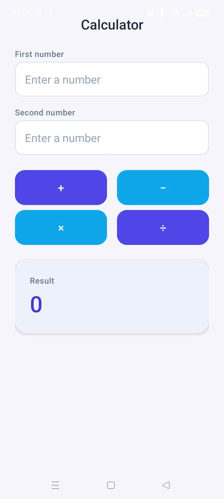
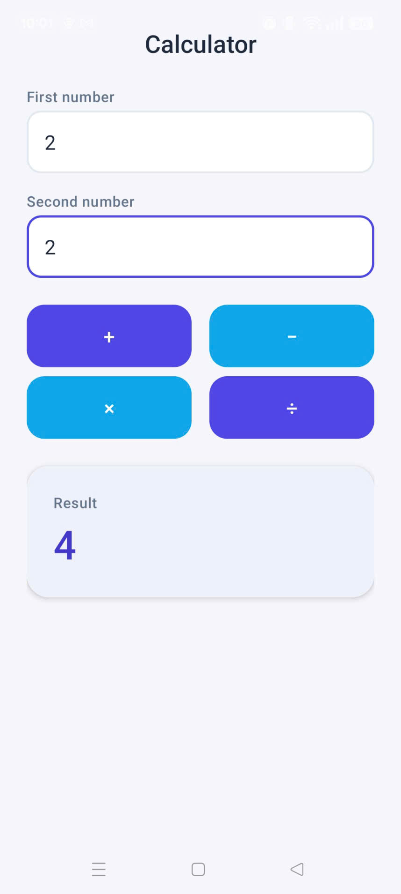
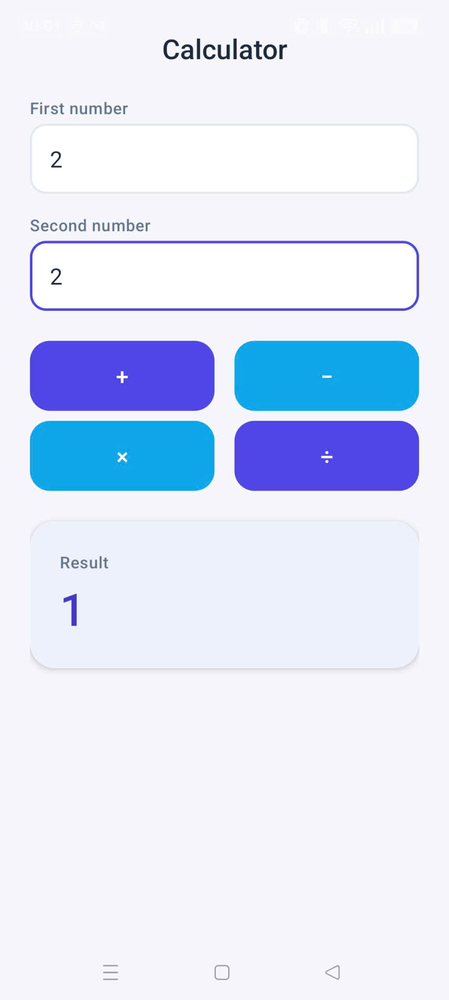
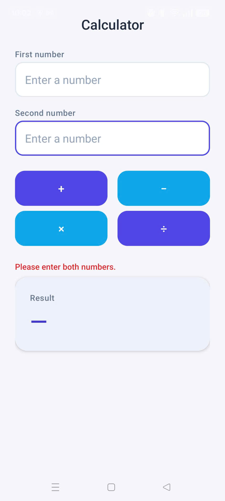
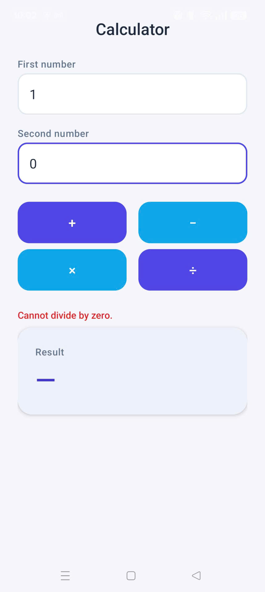

# CalculatorApp


A native Android calculator built with Kotlin and the classic View system (XML layouts) as part of **COMP1786 Exercise 1**. Takes two operands and performs addition, subtraction, multiplication, or division, with input validation and a fully theme-driven UI.

## Features

- **Four operators** — dedicated Add, Subtract, Multiply, and Divide buttons, each computing directly on the two entered operands
- **Input validation** — empty fields and non-numeric input are caught before any calculation runs
- **Divide-by-zero handling** — detected explicitly and reported without crashing
- **Inline error feedback** — validation and arithmetic errors surface as clear, styled inline text rather than crashing or failing silently
- **Theme-driven UI** — a single indigo/sky colour palette (`colors.xml`), spacing/typography scale (`dimens.xml`), and widget styles (`themes.xml`) drive every layout attribute; no hardcoded hex, sp, or dp values in the layout XML

## Screenshots

| | |
|---|---|
| <br>**Initial state** | <br>**Addition** |
| <br>**Subtraction** | <br>**Multiplication** |
| <br>**Division** | <br>**Empty input validation** |
| <br>**Divide-by-zero validation** | |

## Tech stack

- **Language:** Kotlin
- **UI toolkit:** Android View system (XML layouts) — no Jetpack Compose, no third-party UI libraries
- **Build:** Gradle (Kotlin DSL), AGP, `compileSdk 36` / `minSdk 24`
- **Dependencies:** AndroidX core-ktx, activity, lifecycle-runtime-ktx (default template dependencies only)

## Project structure

```
app/src/main/
├── java/com/example/calculatorapp/
│   └── MainActivity.kt        # click handlers, validation, calculation logic
└── res/
    ├── layout/activity_main.xml
    ├── values/colors.xml      # named colour palette
    ├── values/dimens.xml      # spacing, radius, elevation, type scale
    ├── values/themes.xml      # app theme + per-widget styles
    ├── values/strings.xml
    └── drawable/               # stateful button/input/card backgrounds
```

## Building & running

1. Clone the repository:
   ```bash
   git clone https://github.com/luphihung-dev/CalculatorApp.git
   ```
2. Open the project in **Android Studio** (Giraffe or newer) and let Gradle sync, **or** build from the command line:
   ```bash
   ./gradlew assembleDebug
   ```
3. Run on a device or emulator (API 24+):
   ```bash
   ./gradlew installDebug
   ```

## Coursework context

Submitted for **COMP1786 – Exercise 1**: a two-operand calculator app demonstrating Kotlin fundamentals, Android View-based UI, and resource-driven (theme/style/colour) styling.
